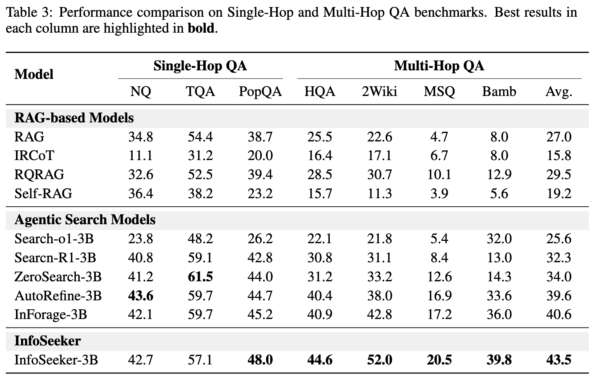

<div align="center">
  
</div>
<h1 align="center">Open Data Synthesis For Deep Research</h1>

<p align="center">
    <a href="https://www.google.com"></a>
    <a href="https://github.com/VectorSpaceLab/InfoSeek"></a>
    <a href="https://huggingface.co"></a>
    <a href="https://huggingface.co"></a>
    <a href="https://opensource.org/license/apache-2-0">
</p>

## 🔎 Roadmap
**InfoSeek**  is currently under active development, with resources and prototypes continuously being published at this repository.
- [x] Initial Codes Release
- [x] Dataset Release
- [x] Data Construction Codes Release
- [x] SFT Training Code Release
- [x] Technical Report Release
- [ ] RL Training Code Release
- [ ] InfoSeeker Model Release

## 🔆 Overview
We propose **InfoSeek**, a scalable data synthesis framework for constructing structurally complex Deep Research tasks. InfoSeek designs a dual-agent system to recursively build a *Research Tree* by mining entities and relations from large-scale text, and blurring itermediate vertices to ensure they form valid sub-problems. The agent then transform these trees into natural language questions whose solutions require traversing the entire hierarchy. Using InfoSeek pipeline, we construct a high-quality, complexity-controllable, and intrinsically verifiable dataset.

## 📋 InfoSeek Datacard


### Example 1:
**Question:** What is a species of bird that was named by a person employed under his father between 1818 and 1824, whose wife was a British artist, and which has three subspecies and body length is generally no more than 6 inches?

**Answer:** Russet sparrow

<details>
  <summary>Tree Structure</summary>
```
{
  "root": {
    "id": "A",
    "entity": "Russet sparrow",
    "question": "What is a species of bird that was named by a person employed under his father between 1818 and 1824, whose wife was a British artist, and which has three subspecies and body length is generally no more than 6 inches?",
    "claims": [
      { "target_id": "B", "claim": "A was named by B" },
      { "target_id": "C", "claim": "A has three subspecies" },
      { "target_id": "D", "claim": "A's body length is generally no more than 6 inches" }
    ],
    "children": [
      {
        "id": "B",
        "entity": "John Gould",
        "claims": [
          { "target_id": "E", "claim": "B was employed by his father between 1818 and 1824" },
          { "target_id": "F", "claim": "B's wife was F" }
        ],
        "children": [
          { "id": "E", "entity": "None", "claims": [], "children": [] },
          { "id": "F", "entity": "Elizabeth Gould", "claims": [], "children": [] }
        ]
      },
      { "id": "C", "entity": "None", "claims": [], "children": [] },
      { "id": "D", "entity": "None", "claims": [], "children": [] }
    ]
  }
}
```

```
(A: Russet sparrow)
 │
 │
 │── [claim] "was named by" ──> (B: John Gould)
 │    │
 │    │
 │    │── [claim] "was employed by his father (1818-1824)"
 │    │
 │    │
 │    │── [claim] "wife was" ──> (F: Elizabeth Gould)
 │
 │
 │
 │── [claim] "has three subspecies"
 │
 │── [claim] "body length is generally no more than 6 inches"
```
</details>

### Example 2:

**Question:** What is a women's football team whose first goals in the 2. Bundesliga were scored by a player born in Korogocho, who was discovered and developed by the Mathare Youth Sports Association?

**Answer:** SV Werder Bremen (women)

<details>
    <summary>Tree Structure</summary>
```
{
  "root": {
    "id": "A",
    "entity": "SV Werder Bremen (women)",
    "question": "What is a women's football team whose first goals in the 2. Bundesliga were scored by a player born in Korogocho, who was discovered and developed by the Mathare Youth Sports Association?",
    "claims": [
      { "target_id": "B", "claim": "A's first goals in the 2. Bundesliga were scored by B" }
    ],
    "children": [
      {
        "id": "B",
        "entity": "Doreen Nabwire",
        "claims": [
          { "target_id": "C", "claim": "B was discovered and developed by C" },
          { "target_id": "D", "claim": "B was born in D" }
        ],
        "children": [
          { "id": "C", "entity": "Mathare Youth Sports Association", "claims": [], "children": [] },
          { "id": "D", "entity": "Korogocho", "claims": [], "children": [] }
        ]
      }
    ]
  }
}
```

```
(A: SV Werder Bremen (women))
 │
 │
 │── [claim] "first goals scored by" ──> (B: Doreen Nabwire)
      │
      │
      │── [claim] "discovered and developed by" ──> (C:Mathare Youth Sports Association)
      │
      │
      │── [claim] "was born in" ──> (D: Korogocho)
```
</details>


## 📊 Performance
Model trained on InfoSeek and our framework shows strong performances on traditional multi-hop benchmarks:



Our 3B model shows competitive results on [BrowseComp-Plus](https://github.com/texttron/BrowseComp-Plus):


## 📄 License
The code and data accompanying this work are released under the [Apache License, Version 2.0](./LICENSE). This permits use, modification, and distribution for research and commercial purposes, provided that proper attribution is given and the terms of the license are followed.

## ❤️ Citing Us
If you find this repository or our work useful, please consider giving a star ⭐ and or citing our work, which would be greatly appreciated:
```bibtex
@article{,
  title={InfoSeek},
  author={},
  journal={arXiv preprint arXiv:},
  year={2025}
}
